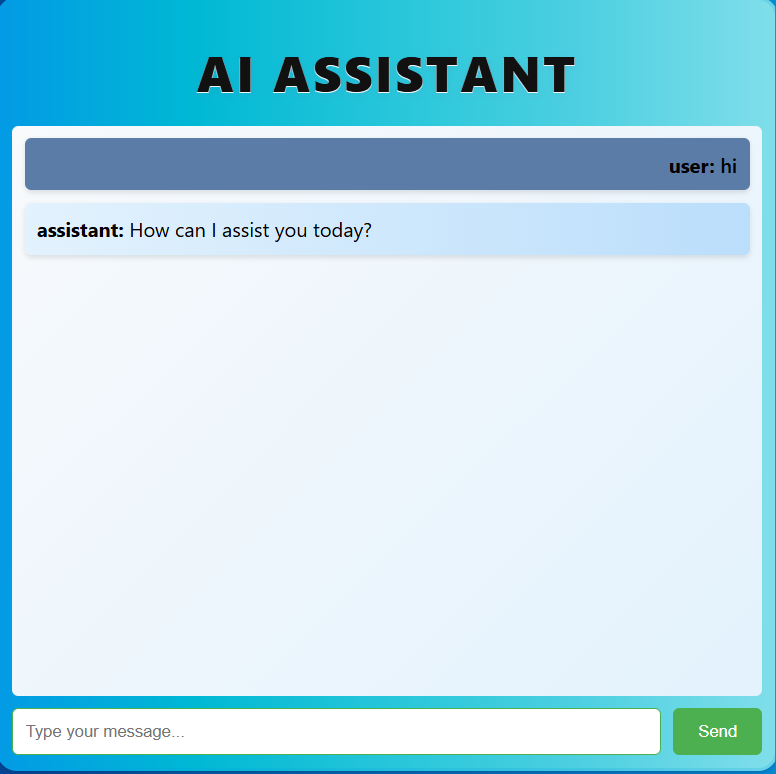
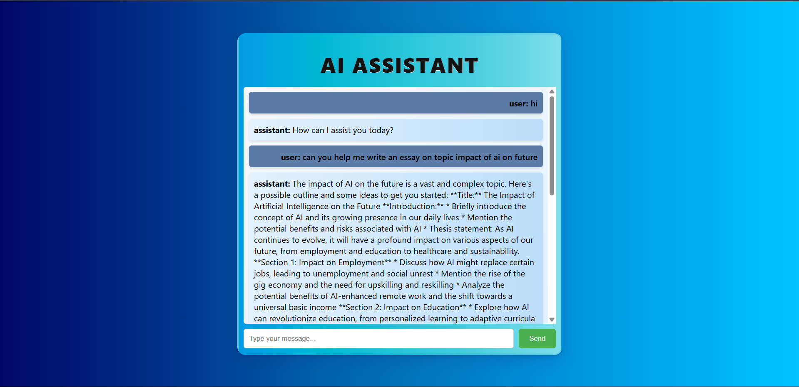

# 🤖 AI Chatbot
A modern AI chatbot application built with **React** frontend and **FastAPI** backend, powered by **Groq's LLaMA 3.1-8b-instant** model.

## 🌐 Live Demo
**Try it out now:** [https://chatbot-1869-ui.netlify.app/](https://chatbot-1869-ui.netlify.app/)

Experience the chatbot in action without any setup required!

---
## ✨ Features
- 💬 Real-time chat interface  
- 🕓 Conversation history with session management  
- 🎨 Modern gradient UI design  
- ⚙️ RESTful API backend  
- 🔐 Environment-based configuration  
---
## 🖼️ Screenshots
### 💻 Chat Interface

### 📜 Conversation History

---
## 🛠 Tech Stack
### Frontend
- ⚛️ React 18  
- 📡 Axios for API communication  
- 🎨 Modern CSS with gradient theming  
### Backend
- 🚀 FastAPI  
- 🧠 Groq API (LLaMA 3.1-8b-instant)  
- 🐍 Python 3.8+  
---
## 🔧 Prerequisites
Make sure you have the following installed:
- 🟢 Node.js v16+  
- 🐍 Python 3.8+  
- 🔑 Groq API Key (get it from [Groq Console](https://console.groq.com/keys))  
---
## 🚀 Installation & Setup
### 1️⃣ Clone the Repository
```bash
git clone https://github.com/Arnab-1869/AI-ChatBot.git
cd AI-ChatBot
```
### 2️⃣ Backend Setup
Change directory to backend, create and activate a Python virtual environment, install dependencies, copy the environment file, add your API key, then start the server:
```bash
cd backend
python -m venv venv
# On Windows
venv\Scripts\activate
# On macOS/Linux
source venv/bin/activate
pip install -r requirements.txt
cp .env.example .env
```
Edit the `.env` file to add your Groq API key:
```
GROQ_API_KEY=your_actual_api_key_here
```
Start the backend FastAPI server:
```bash
uvicorn main:app --reload
```
### 3️⃣ Frontend Setup
From the root project folder, change directory to frontend, install node modules, and start the React development server:
```bash
cd ../frontend
npm install
npm start
```
---
### **Summary:**
* Clone the repository
* Setup backend (create venv, install dependencies, set env, run uvicorn)
* Setup frontend (install npm packages, start React server)
---
## 🤝 Contributing
1. Fork the repository
2. Create a feature branch
3. Make your changes
4. Submit a pull request
## 📄 License
This project is open source and available under the [MIT License](LICENSE).
